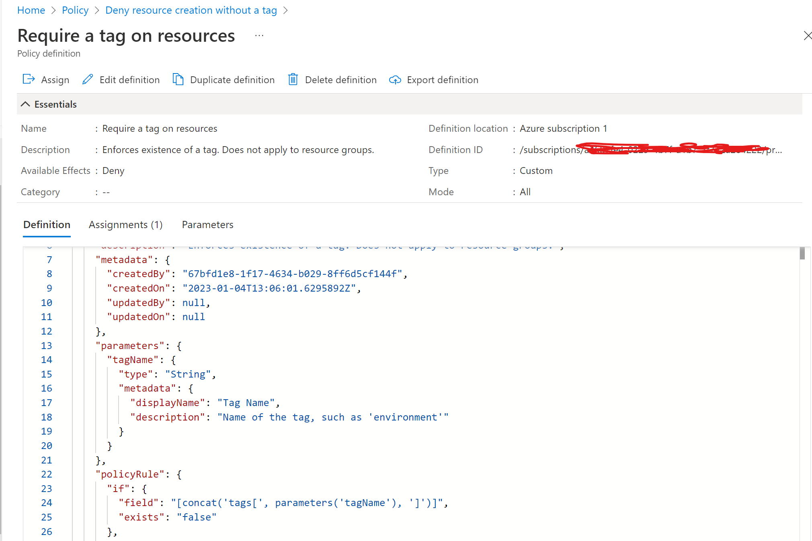

# Azure Infrastructure Operations Project: Deploying a scalable IaaS web server in Azure

### Introduction
For this project, you will write a Packer template and a Terraform template to deploy a customizable, scalable web server in Azure.

### Getting Started
1. Clone this repository

2. See the  [Instructions seciton](#Instructions)

### Dependencies
1. Create an [Azure Account](https://portal.azure.com) 
2. Install the [Azure command line interface](https://docs.microsoft.com/en-us/cli/azure/install-azure-cli?view=azure-cli-latest)
3. Install [Packer](https://www.packer.io/downloads)
4. Install [Terraform](https://www.terraform.io/downloads.html)
5. Terraform [Authentication to Azure](https://registry.terraform.io/providers/hashicorp/azurerm/latest/docs)


### Instructions
1. Create Azure Policy definition  

```
#Create the policy definition
az policy definition create --name tagging-policy --display-name "Require a tag on resources" \ --description "Enforces existence of a tag. Does not apply to resource groups." --rules azurepolicy-tag.rules.json --params azurepolicy-tag.params.json --mode All

#Show the policy
az policy definition show --name "tagging-policy"

```


2. Assign Policy to the full subscription
```

#Set tag-policy to full subscription
az policy assignment create --name tagging-policy --display-name "Deny resource creation without a tag" --policy /subscriptions/$SUBSCRIPTION_ID/providers/Microsoft.Authorization/policyDefinitions/tagging-policy --params azurepolicy-assignment-tag.json

#Show policy assignment
az policy assignment show --name tagging-policy
```

3. How to build the image using Packer
``` 
packer build  \ 
    -var "image_name=pepe" \
    -var "resource_group_name=udacity" \
    -var "created_by=IvanG" server.json    
```

5. How to build the IaC with Terraform
 
```
#Take a look to the solution plan
terraform plan -out solution.plan

#Apply the changes in your azure subscription
terraform apply

#Destroy your infrastructure 
terraform destroy
```

## Customize terraform

`variables.tf` provides the following customizable variables:
- `prefix:` Use a prefix for all resources created in azure
- `location:` Region to be used in Azure
- `username:` VM username
- `password:` VM password
- `createdBy:` Mandatory Tag CreatedBy in all resources 
- `packer_image_name:` Image name created by packer see `az image list`
- `packer_resource_group_name:` Packer Resource group where image was created (It might differ from general resource group )
- `virtual_machines_count:` Number of VMs deployment 

## Customize packer
`server.json` provides the following customizable variables via `environment variable` or `packer -var 'key=value'`:
- `ARM_CLIENT_ID:` Azure client ID
- `ARM_CLIENT_SECRET:` Azure Client Secret
- `ARM_SUBSCRIPTION_ID:` Azure Subscription ID
- `ARM_CREATED_BY:` Enforce Tag 'Created By' 
- `IMAGE_NAME:` Image Name when packer build is executed
- `RESOURCE_GROUP_NAME:` Resource Group Name when packer build is executed

### Output
- Policy with `Deny resource creation without a tag` and assign to the subscription. see `az policy assignment --help` for more options. 
- Packer image with Ubuntu 18.04-LTS sku.
- Resource group 
- Virtual Network and subnet on that virtual network.
- Security Group with Inbound/Outbound rules.
- Network Interface
- Public IP
- LoadBalancer with backend address pool and andress pool association for the network interface and load balancer.
- Managed disks for the VMs.

### Helpers
1. Policy definition and assignment
```
./ps/create-policy.ps1

```

2. Create VM image with packer 
```
./ps/create-packer.ps1

```

3. Terraform create & destroy
```
./ps/terraform.ps1

```


### Screenshots
